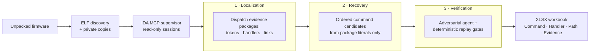

<div align="center">

# CLIMirror

**CLI command → handler mappings, recovered from firmware with replayable evidence.**

[](https://www.python.org/downloads/)
[](LICENSE)
[](#environment)
[](#evidence-ledger)

*Command strings are easy to grep; the function that actually handles them is not.
CLIMirror drives three evidence-bounded agents through IDA Pro and exports only
mappings whose full dispatch chain replays byte-for-byte.*

</div>

---

## Why CLIMirror

Text mining finds command literals but not their handlers; manual reverse
engineering binds them slowly; unconstrained LLM agents guess. CLIMirror closes
the gap: **localize** dispatch evidence, **recover** command literals, **verify**
every claim against an append-only ledger.

| | CLIMirror | String mining | Manual RE |
|---|---|---|---|
| Command → handler binding | Verified dispatch chain | Not recovered | Manual, slow |
| LLM output trust | Evidence ledger + hash replay | — | — |
| Cross-library handlers | Unique exact `.dynsym` match | Missed | Manual |
| Deliverable | Four-column workbook + evidence chain | String list | Ad-hoc notes |

## How it works



The code layout mirrors the paper: `agents/localization.py` ·
`agents/recovery.py` · `agents/verification.py`.

## Environment

Ubuntu 24.04 · Python 3.12 · `uv` · IDA Pro 9.1 Professional with a licensed
Hex-Rays decompiler for the target architecture (the paper analyzes ARM and MIPS).
Activate `idalib` for the `uv`-managed Python and make sure IDA opens without a
license prompt.

## Installation

```bash
uv sync --locked
cp config.example.toml config.toml   # then edit [llm].api_key
chmod 600 config.toml
```

Every key beyond `[llm].api_key` (your DeepSeek key) has a working default in
[`config.example.toml`](config.example.toml). `config.toml` is gitignored; the
key never enters run logs, evidence records, or exported workbooks.

## Usage

```bash
uv run climirror --firmware /absolute/path/to/unpacked-firmware
```

Writes `output/<firmware-name>.xlsx` with exactly four text columns:
`Command`, `Handler Address and Name`, `Handler Relative Path`, `Evidence Chain`.
IDA-generated names such as `sub_401000` are labeled `[IDA auto]`; every cell is
written as text so commands like `=help` cannot become formulas. A binary that
fails analysis is recorded and skipped; a run with no surviving mapping still
emits the header-only workbook. `--verbose` enables debug logging.

## IDA MCP lifecycle

CLIMirror reuses mrexodia's `idalib-mcp` supervisor at the fixed loopback
endpoint `http://127.0.0.1:13337/mcp`, or starts one itself if the port is free.
- Each ELF is copied into the run directory first; IDA databases and caches land
  next to the private copy, never in the firmware tree.
- The `database` session ID is injected by CLIMirror's wrapper — the model can
  neither supply nor replace it.
- At shutdown every database is closed with `idb_close(save=false)`; a
  pre-existing supervisor is left running.

## The three agents

All roles are LangChain `create_agent` graphs with Pydantic-structured output;
each keeps its full prompt in its own source file.

- **Localization** — reverse-engineering analyst: strings, xrefs, control flow,
  pointer tables, registration sites. Read-only IDA tools only.
- **Recovery** — reconstructs ordered command literals from one immutable
  package. No IDA access: a token, alias, or handler is usable only if it
  already exists in the package.
- **Verification** — adversarial auditor over four checks (command, handler,
  structure, traceability). A deterministic outer verifier makes the final
  call; the model cannot override a failed gate.

Rejected candidates become negative few-shots for recovery (at most two
feedback rounds per package). Agents see exactly this read-only tool set:

```text
server_health, entity_query, find_regex, lookup_funcs, imports_query,
xrefs_to, callees, callers, basic_blocks, decompile, disasm, callgraph,
get_string, get_bytes, get_int, get_global_value, int_convert
```

No database mutation, patching, renaming, Python execution, debugger control, or
saving is exposed. Persisted output stores the structured conclusion and a short
`evidence_rationale` — never the model's private chain of thought.

## Evidence ledger

Every MCP observation is recorded with its arguments, result hash, and a stable
evidence ID. Agent output is accepted only when every cited ID exists in the
ledger; verification repeats each cited query and compares result hashes — a
missing, changed, or unreplayable observation blocks export. Cross-library
candidates additionally require one unique exact `.dynsym` export plus matching
IDA import and call evidence; approximate or duplicate matches are rejected.

## Run artifacts and limitations

Run data lives under `runs/`: private ELF copies, the ledger, per-file status,
cached results, MCP logs, and a summary. Unchanged firmware plus unchanged
non-secret settings resume from cached results. CLIMirror is static analysis: a
mapping is exported only when localization, recovery, deterministic
verification, and evidence replay all succeed.

Main dependencies: `langchain`, `langchain-deepseek`, `langchain-mcp-adapters`,
`ida-pro-mcp`, `pydantic`, `pyelftools`, `openpyxl` — pinned in `uv.lock`.

## Project layout

```text
src/climirror/   cli, config, runner, IDA/MCP adapters, evidence ledger, export
src/climirror/agents/   the three role prompts and drivers
config.example.toml     all keys with defaults
```

## License

Apache-2.0 — see [LICENSE](LICENSE).
